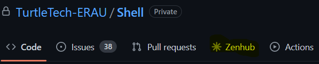

## Vision Statement
Our vision is to help improve the TurtleTech operations crew deployment capabilities by making the payload more swappable between various UAVs. TurtleTech is an unmanned aircraft created by Northrop Grumman and partnered with the Brevard Zoo to help conserve and educate the world on Florida's turtle population. The UAV currently flies within line-of sight capturing images, and uses a neural network on a Nvidia Jetson device to identify turtles from an aerial view. As the Embry Riddle TurtleTech team, our goal is to maintain functionality of the neural network software and hardware payload, while creating a framework and instructions to transition the payload between several UAVs to increase the ease of deployment of the system. 

## Product Backlog
For product Backlog, see ZenHub tab (GitHub extension)  

